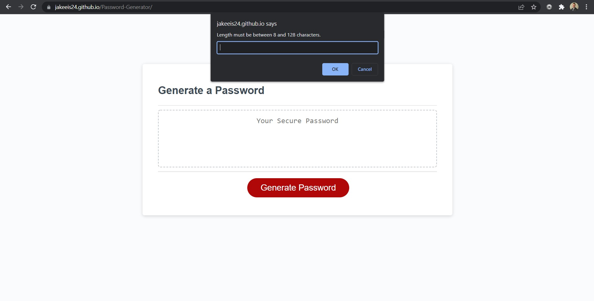
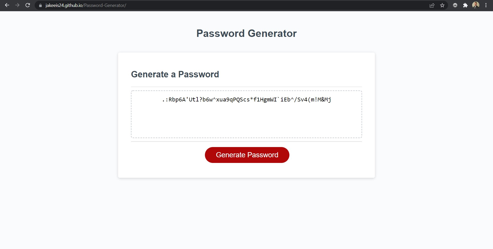

# Password Generator

In this repository you will find the Javascript code I made to add onto the starter HTML and CSS code to create a fully functioning random password generator.

# Functionality

Upon page load, users will see the webpage (screenshot below) and will only be able to interact with the page by pressing the red 'Generate Password' button. Upon pressing the button, users will be prompted to select a password length followed by a series of confirm functions on whether or not they want to include lowercase characters, uppercase characters, special characters, or numbers.
Once they finish the prompt and confirm functions, their password will be displayed on the screen for them to copy.

If the user does not select a password between 8 and 128 characters, an alert function will notify them and the process will start over. If the user does not specify any character type from the prompts, a different alert function will notify them to select at least one character category, and they will start over.

Once the user successfully specifies the criteria, a for loop will take the characters specified and randomize them to the desired length using (Math.floor(Math.random)).

# What I Learned

This assignment showed me how powerful JavaScript is with just the lightest amount of user interactivity implemented in the code. I completed this assigment having to utilize various resources through class as well as a few friends who are in the industry. I needed a lot of help initially because I was having a hard time understanding functions and variables and if statements and how to implement them within eachother. It is now starting to click for me and I may try to make another password generator without utilizing any resources.

# Link to Deployed Application

https://jakeeis24.github.io/Password-Generator/

# Screenshot of Deployed Application

After the user clicks the red button:

An example with specifications of 50 characters, all character types selected:

